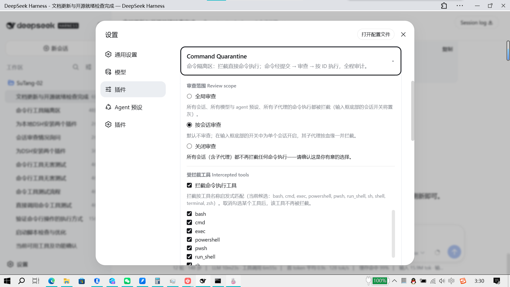
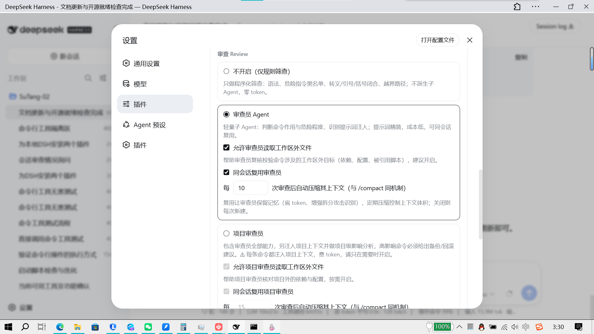
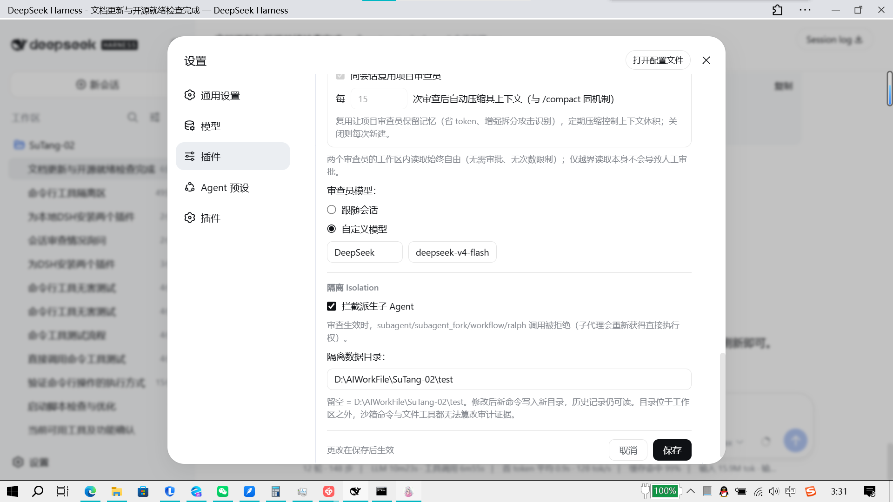
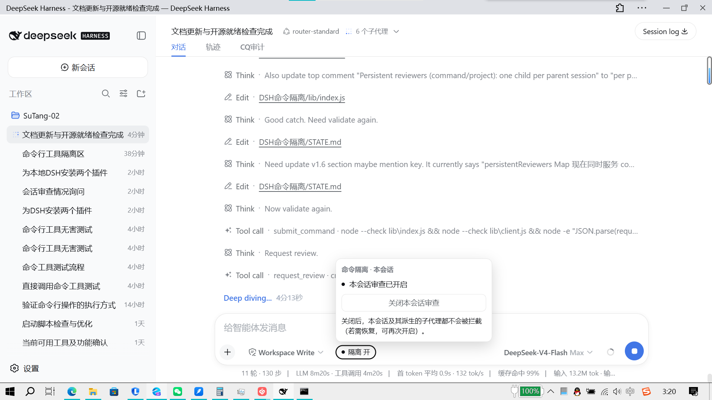
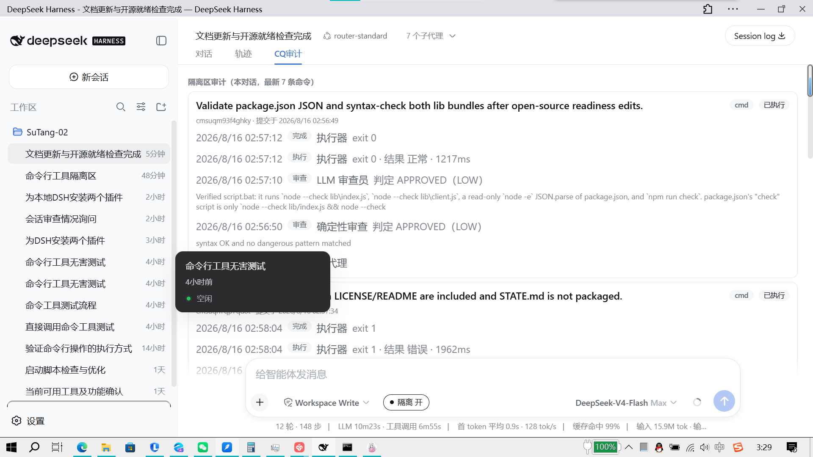
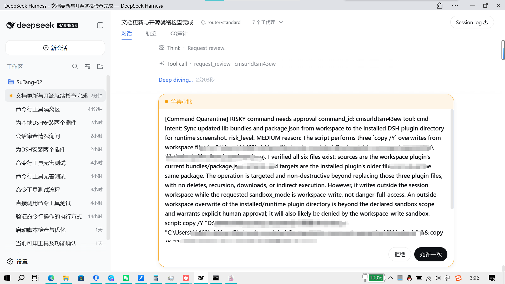

# DSH Command Quarantine

你有被 agent 崩溃过电脑/客户端/项目吗？

前几天我下载 DSH 准备 DIY，结果不知道它干了啥，我整个 D 盘差点被删了！后来发现是它的一条命令的符号写错了，导致删除命令执行错误。

于是有了这个项目：在 agent 使用命令行工具前加一道隔离层。所有命令必须先提交、再审查，通过后才执行；审查过程全程留审计，危险命令会弹窗让你确认。

## 功能

- 拦截 Agent 直接执行命令
- 命令先进入隔离区，不直接运行
- 双层审查：确定性规则 + 可选 LLM 审查员
- 支持普通审查员 / 项目审查员
- 危险命令统一弹窗人工确认
- 全程审计，命令可追溯

## 工作原理

```text
Agent 想执行命令
  → submit_command 写入隔离区
  → request_review 审查
  → APPROVED：自动执行
  → RISKY：弹窗人工确认
  → REJECTED：返回理由
```

## 安装

1. 把本目录放到 DSH loader 模块回退目录：

   ```text
   $DSH_HOME\profiles\node_modules\@sutang\dsh-command-quarantine\
   ```

2. 在 `$DSH_HOME\cordis.patch.yml` 添加：

   ```yaml
   - insert:
       - id: command-quarantine
         name: '@sutang/dsh-command-quarantine'
   ```

3. 将 `command-quarantine` 加入部署的 `WEB_SETTINGS_NAMESPACES` 白名单，否则设置卡片不可用（插件本身可用）。

4. 重启 DSH。

## 设置

- 审查档位：仅规则 / 审查员 / 项目审查员
- 是否允许读取工作区外
- 是否同会话复用审查员
- 审查员模型
- 隔离数据目录

## 界面预览

| 截图 | 说明 |
|---|---|
|  | 插件设置卡片：审查档位、读取范围、复用/压缩选项 |
|  | 插件设置卡片：审查员模型与拦截配置 |
|  | 插件设置卡片：存储目录等高级配置 |
|  | 对话输入区旁的会话级隔离开关 |
|  | CQ 审计页签：命令提交/审查/执行/结果 |
|  | RISKY 命令的统一人工审批弹窗 |

## 说明

本插件只隔离命令行执行，不接管 DSH 自带的 `write` / `edit` 文件工具；文件读写空间由 DSH 权限沙箱负责。

## 文档

- [设计文档](./docs/design.md)

## License

MIT
